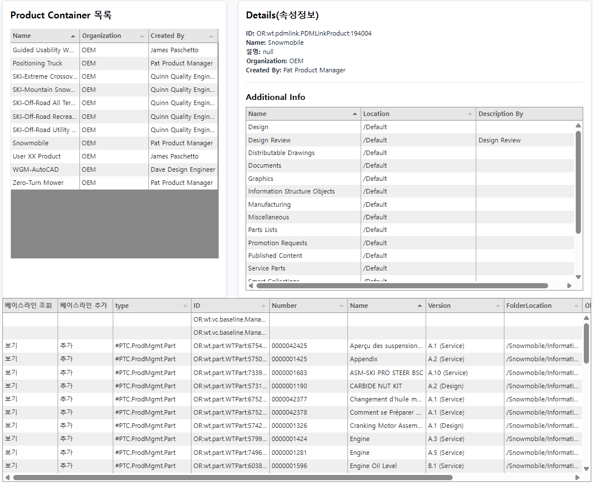
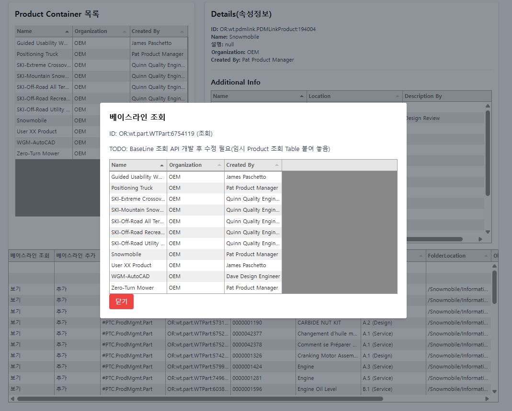
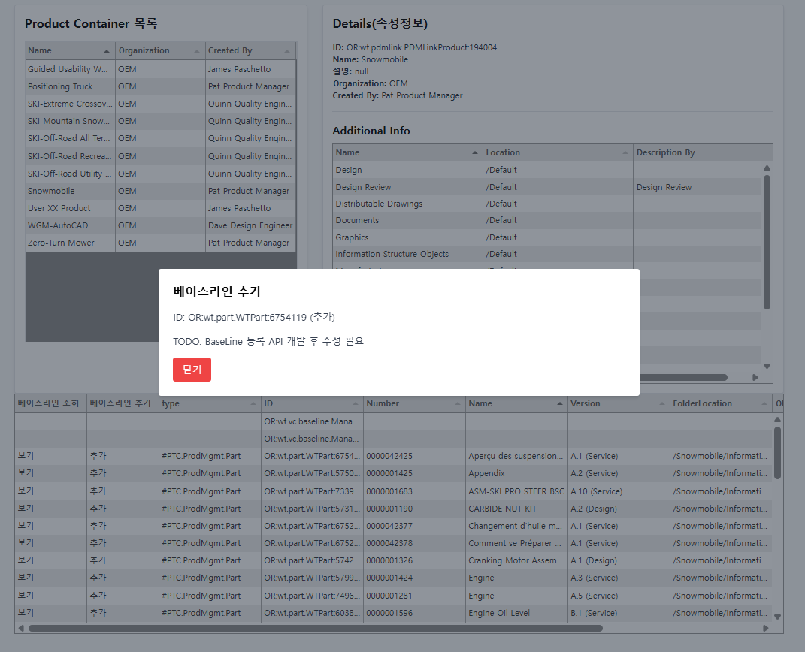

# wrs
windchill rest services

# spec
- corretto-21.0.6
- SpringBoot 3.4.4
- javax.servlet:jstl:1.2
- lombok

# 접속주소
http://localhost:8080/main

# 실행 방법
```
gradlew bootRun
```

# REST SERVICE URL
## Cloud
https://pp-2504240936dd.portal.ptc.io/Windchill/netmarkets/html/wrs/doc.html

# TODO
- [x] Product Container 가져오기
- [x] Product Container 하위 Folder 가져오기
- [x] Folder 하위 Part 객체 가져오기
- [ ] Folder 및 객체 Tree 구조로 수정
- [ ] Part에 지정된 Baseline 정보 가져오기
- [ ] Part에 Baseline 생성하기
- [ ] 인증 SSO 또는 JWT로 수정해야 사용 가능 할거 같음
- [ ] 세션추가 (스프링 시큐리티 붙이기)

# 작업 진행 내용

- Product Container, Cabinet, Contents 조회


- Baseline 조회


- Baseline 조회 
